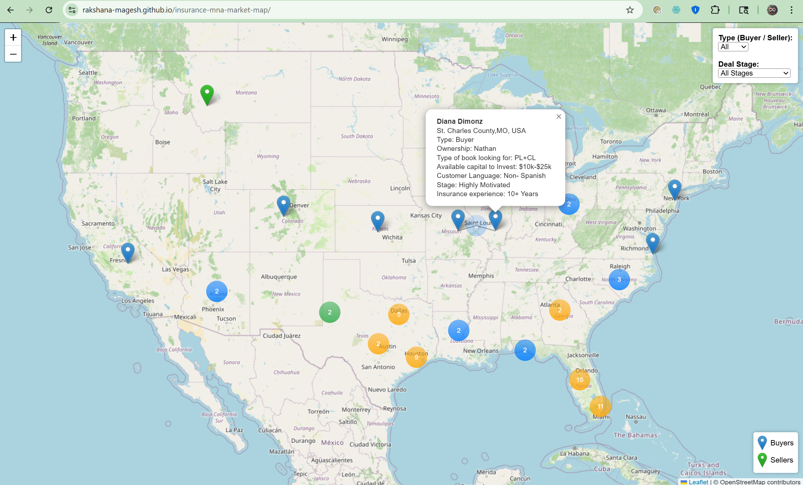
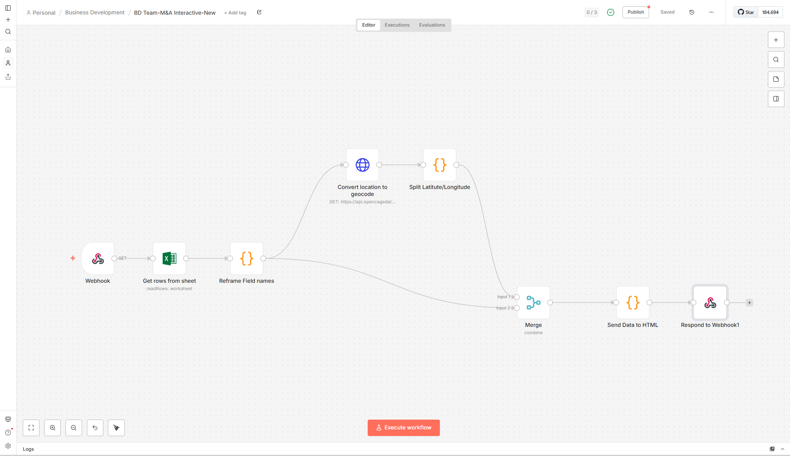
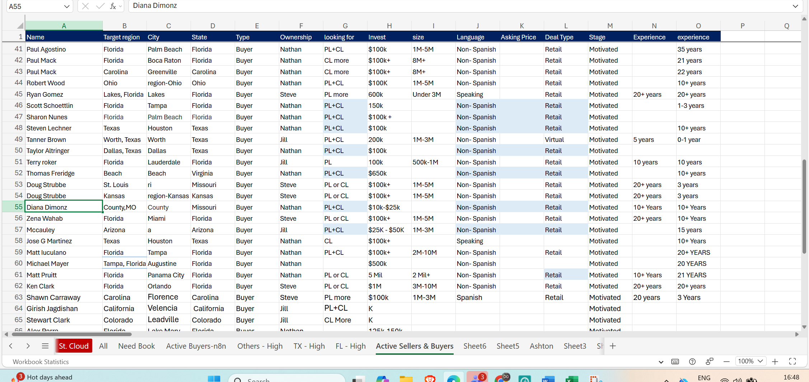

# Real-Time M&A Buyer-Seller Mapping System
🗺️ **[View Live Map](https://rakshana-magesh.github.io/insurance-mna-market-map/)**

A real-time market intelligence system that transforms raw M&A data into an interactive geospatial decision tool for visualizing buyer and seller distribution across the U.S.

## Problem Statement

The Business Development team lacked a centralized, visual way to understand:

- Where buyers and sellers are located geographically
- Market density and clustering
- Deal stage distribution across regions

Data existed in Excel, but decision-making was slow, manual, and lacked spatial insights.

## Solution Overview

Built a real-time automation pipeline that:

- Extracts buyer & seller data from Excel (Microsoft 365)
- Cleans and standardizes location data
- Converts locations into geocoordinates using a geocoding API
- Serves processed data via webhook
- Dynamically renders an interactive map using Leaflet.js

## System Architecture

### Workflow (n8n)

1. **Webhook Trigger**
   - Initiates workflow when the HTML map loads

2. **Data Extraction**
   - Reads buyer & seller data from Excel (Microsoft 365)

3. **Data Transformation**
   - Cleans and standardizes fields (location, type, etc.)
   - Filters incomplete records

4. **Geocoding**
   - Converts location → latitude & longitude using API

5. **Data Structuring**
   - Formats output for frontend consumption

6. **Webhook Response**
   - Sends processed JSON data to frontend

## Frontend (Interactive Map)

Built using **Leaflet.js** with advanced features:

- 📍 Buyer & Seller markers (color-coded)
- 🔵 Blue → Buyers  
- 🟢 Green → Sellers  
- 🟠 Orange → Mixed clusters  

- 📊 Marker clustering for dense regions
- 🕸 Spiderfy behavior on cluster click
- 🎯 Smart filtering:
  - By Type (Buyer/Seller)
  - By Deal Stage

- 📌 Rich popups with:
  - Name, location
  - Capital, book size, deal type
  - Experience & ownership details

- ⚡ Real-time data fetch via webhook

## End-to-End Flow

Excel Data → n8n Workflow → Geocoding API → Webhook → Interactive Map (Leaflet)

This pipeline ensures real-time synchronization between backend data and frontend visualization.

## Key Insight

This system bridges the gap between raw operational data and strategic decision-making by converting static Excel datasets into a live, interactive market view.

It enables business teams to:
- Identify high-density deal regions instantly
- Spot buyer-seller overlaps
- Make faster, data-driven M&A decisions

## Tech Stack

- **Automation**: n8n  
- **Data Source**: Microsoft Excel 365  
- **APIs**: Geocoding API (OpenCage)  
- **Frontend**: HTML, JavaScript  
- **Mapping Library**: Leaflet.js  
- **Data Transfer**: Webhooks (JSON)

## Key Features

- Real-time data pipeline from Excel → Map
- Automated geolocation processing
- Interactive visualization with clustering logic
- Dynamic filtering for better decision-making
- Scalable architecture for additional data layers

## Impact

- Eliminated manual geographic analysis
- Enabled instant visualization of market distribution
- Improved decision-making for M&A targeting
- Reduced analysis time from hours → seconds

## Author

Rakshana Magesh  
Business Operations Associate @Renegade Insurance

